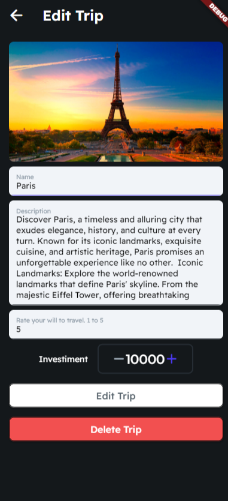
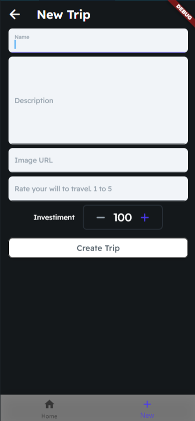

# Description

This is a study project to learn the basics of FlutterFlow.

# Trips App

This app is a CRUD constructed on FlutterFlow. It has 2 lists on the home page. Through the navbar is possible to create a new trip, and clicking on any list item is possible to edit the item or delete it.

Editing/creating a trip should reflect the changes on the list.

# Screenshots

